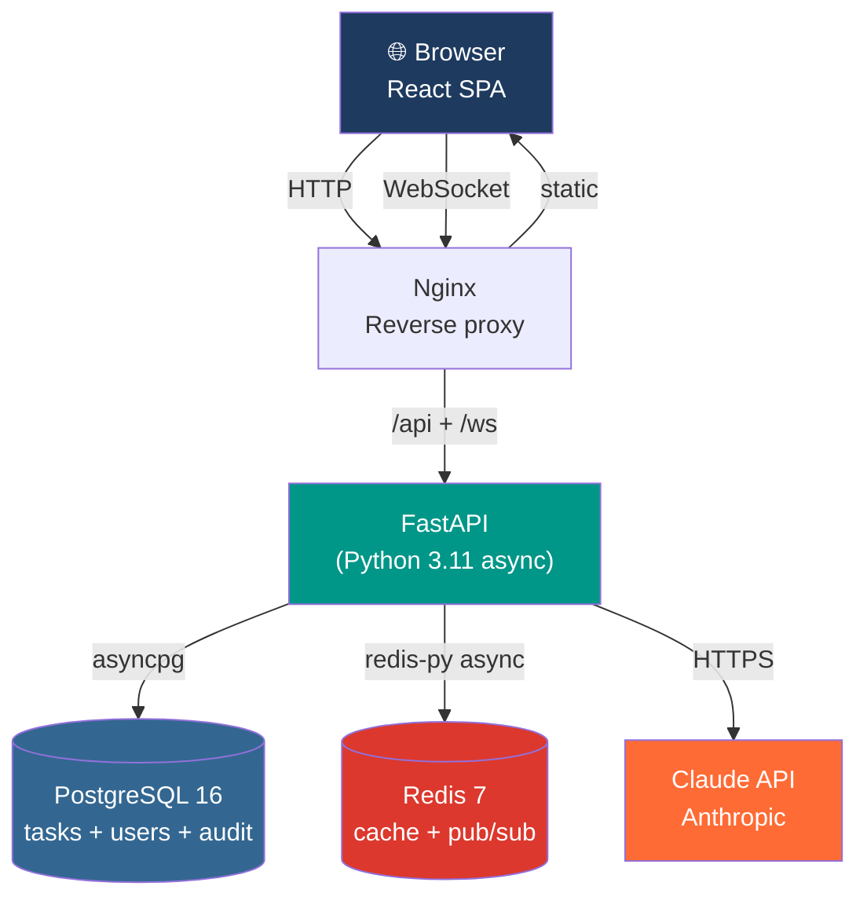
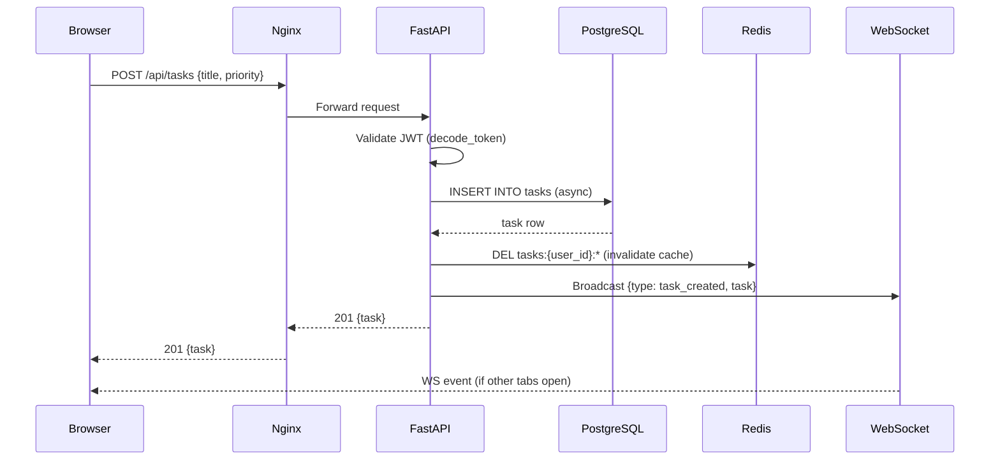
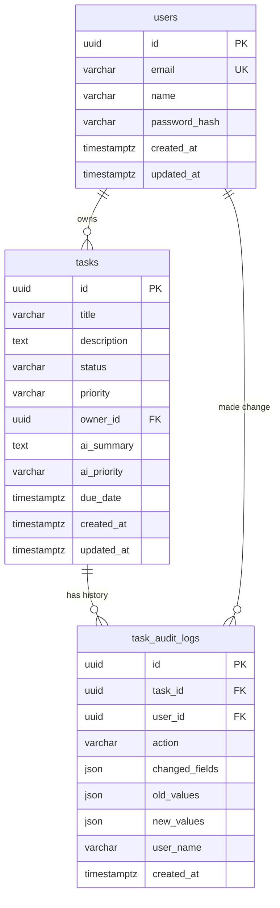

# TaskMind Architecture

## Overview

TaskMind is a full stack AI application built with:
- **React 18** frontend (SPA)
- **FastAPI** backend (async Python)
- **PostgreSQL 16** primary database
- **Redis 7** cache and session store
- **Claude** (Anthropic) AI integration

## System Diagram



## Request Flow — Task Creation



## Database Schema



## Key Indexes

```sql
-- Task listing (most common query)
CREATE INDEX idx_tasks_owner_created
    ON tasks(owner_id, created_at DESC);

-- Status filtering
CREATE INDEX idx_tasks_status ON tasks(status);

-- Priority filtering
CREATE INDEX idx_tasks_priority ON tasks(priority);

-- Audit log lookup
CREATE INDEX idx_audit_task_id ON task_audit_logs(task_id);
CREATE INDEX idx_audit_created ON task_audit_logs(created_at DESC);
```

## Caching Strategy

```
Cache-aside pattern:

READ:
  key = "tasks:{user_id}:{status}:{priority}:{page}"
  result = cache.get(key)
  if result: return result          # cache HIT (~0.2ms)
  result = db.query(...)            # cache MISS (~15ms)
  cache.set(key, result, ttl=30)
  return result

WRITE (create/update/delete):
  db.execute(...)
  cache.delete_pattern("tasks:{user_id}:*")  # invalidate all pages

TTL by data type:
  task lists:      30s   (freshness vs load balance)
  task stats:     300s   (expensive query, slow-changing)
  AI analysis:   3600s   (same title = same result)
  weekly summary:  900s  (expensive AI call, 15min ok)
```

## AI Integration

```
All AI endpoints have a mock fallback:

if ANTHROPIC_API_KEY not set:
    return mock_response()   # keyword-based, instant, free

if api_call fails:
    return mock_response()   # graceful degradation

This means:
  - App works in local dev without any API key
  - App continues working if Anthropic has an outage
  - CI/CD tests pass without secrets
  - Demo can be run without spending API credits
```

## Authentication Flow

```
JWT (JSON Web Token) — stateless authentication

1. POST /api/auth/login {email, password}
   → verify bcrypt hash
   → create JWT: {sub: user_id, exp: now + 60min}
   → return {access_token: "eyJ..."}

2. Every protected request:
   → Authorization: Bearer eyJ...
   → decode_token(token) → user_id
   → SELECT * FROM users WHERE id = user_id

Why stateless JWT (not sessions):
   → No server-side session storage needed
   → Works with multiple API workers (no shared session state)
   → Scales horizontally
   Tradeoff: can't instantly revoke tokens (use Redis blacklist for that)
```

## WebSocket Architecture

```
Connection lifecycle:
  1. Browser connects: WS /ws?token={jwt}
  2. Server decodes token → validates user
  3. ConnectionManager.connect(ws, user_id)
  4. Keepalive: server sends "keepalive" every 30s
     Browser responds with "ping"
  5. On task change: ConnectionManager.send_to_user(user_id, event)
  6. All open tabs receive the event → React state updates

Storage:
  _connections: dict[user_id → set[WebSocket]]
  In-memory (per process)

Scale concern:
  With multiple API workers, each worker has its own ConnectionManager.
  Fix for production: use Redis pub/sub to broadcast across workers.
```